# 외래 진료 운영 대시보드 — 사용자 매뉴얼

---

## 목차

1. [시작하기 — 로그인](#1-시작하기--로그인)
2. [대시보드 한눈에 보기](#2-대시보드-한눈에-보기)
3. [기간 선택하기](#3-기간-선택하기)
4. [진료과별 / 교수별 보기 전환](#4-진료과별--교수별-보기-전환)
5. [표 정렬·검색·필터링](#5-표-정렬검색필터링)
6. [상세 추세 보기](#6-상세-추세-보기)
7. [엑셀로 내보내기](#7-엑셀로-내보내기)
8. [데이터 출처 확인](#8-데이터-출처-확인)

<div style="page-break-before: always"></div>

## 1. 시작하기 — 로그인

브라우저(Chrome·Edge 권장)에서 대시보드 주소로 접속하면 로그인 화면이 나타납니다.

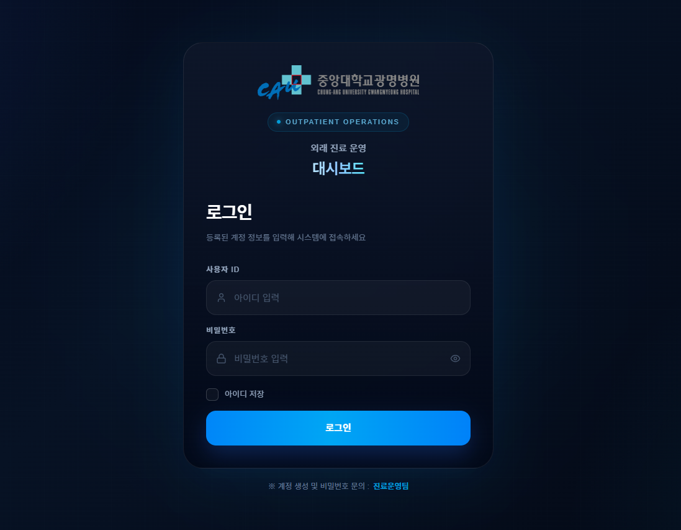

### 사용법
1. **사용자 ID**와 **비밀번호**를 입력
2. 비밀번호 옆 👁 아이콘으로 입력값 표시·숨기기
3. **아이디 저장**에 체크하면 다음 접속 시 ID가 자동 입력
4. **[로그인]** 클릭

### 로그인이 안 될 때

| 증상 | 원인·해결 |
|------|-----------|
| "아이디와 비밀번호를 입력해주세요" | 빈 필드 → 모두 입력 |
| "아이디 또는 비밀번호가 일치하지 않습니다" | 오타 확인. **5회 연속 실패 시 30분 잠금** |
| 계정 잠김 | 30분 대기 또는 진료운영팀에 비밀번호 재설정 요청 |
| 계정 없음 | **진료운영팀**에 계정 생성 요청 |

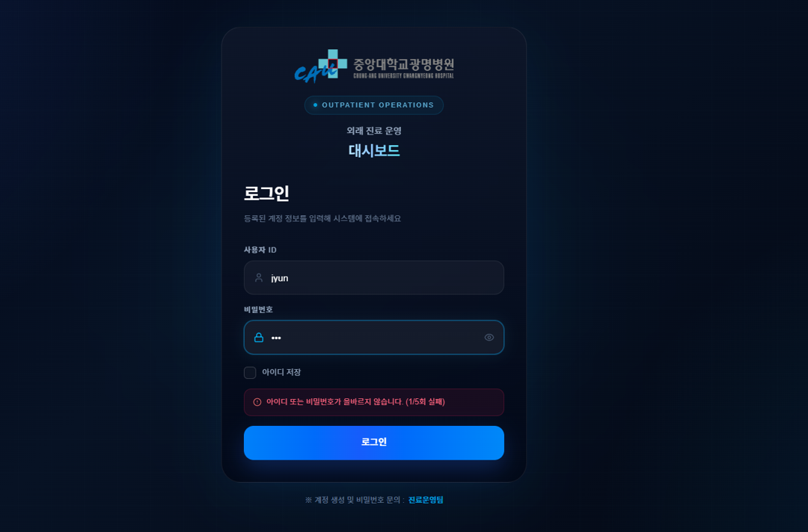

<div style="page-break-before: always"></div>

## 2. 대시보드 한눈에 보기

로그인 직후 메인 화면입니다. **상단 헤더 → KPI 카드 6개 → 필터 바 → 데이터 표 → 범례** 순으로 구성됩니다.

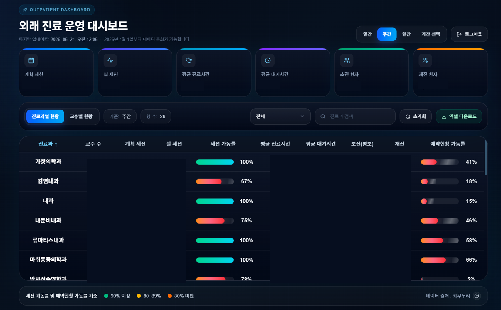

### 화면 구성 요약

| 영역 | 위치 | 설명 |
|------|------|------|
| **상단 헤더** | 맨 위 | 좌측 제목, 우측 기간 토글·[로그아웃] |
| **마지막 업데이트** | 헤더 아래 | EMR에서 가장 최근 데이터 수집 시각 |
| **KPI 카드 6개** | 상단 | 계획·실 세션, 평균 진료·대기시간, 초·재진 환자 |
| **필터 바** | 표 위 | 보기 전환, 검색, 진료과 선택, 엑셀 다운로드 |
| **데이터 표** | 가운데 | 진료과 또는 교수별 상세 지표 |
| **범례** | 표 아래 | 색 의미(90↑/80~89/80↓) + 데이터 출처 |

### KPI 카드 6개 상세

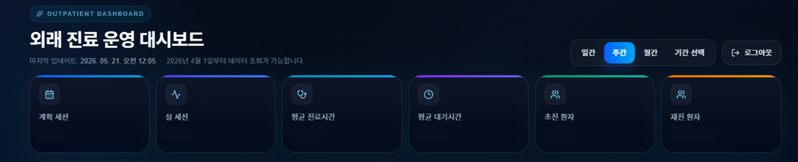

| 카드 | 의미 | 단위 |
|------|------|------|
| **계획 세션** | 예약된 진료 세션 수 | 건 |
| **실 세션** | 실제 진행된 세션 수 | 건 |
| **평균 진료시간** | 한 환자당 평균 진료 소요 | 분 |
| **평균 대기시간** | 환자가 진료 전 대기한 평균 시간 | 분 |
| **초진 환자** | 해당 기간 신규 방문 환자 수 | 명 |
| **재진 환자** | 해당 기간 재방문 환자 수 | 명 |

<div style="page-break-before: always"></div>

## 3. 기간 선택하기

화면 우상단의 토글 버튼으로 조회 기간을 바꿉니다.

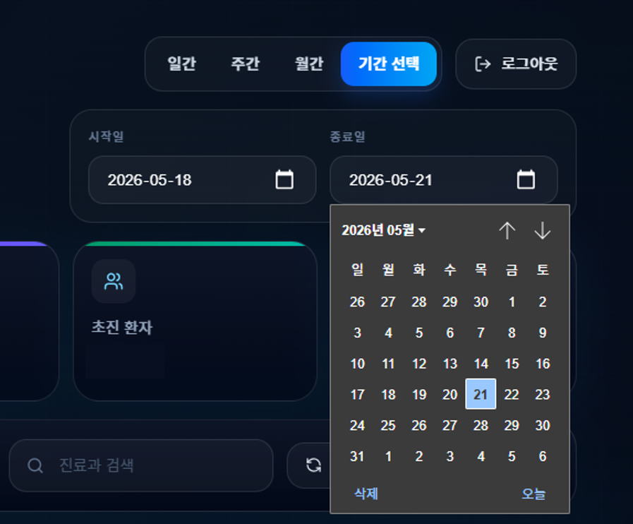

| 버튼 | 의미 | 기준일 |
|------|------|--------|
| **일간** | 특정 하루 | 가장 최근 영업일 |
| **주간** | 최근 7일 | 오늘 포함 직전 7일 |
| **월간** | 이번 달 | 이번 달 1일 ~ 오늘 |
| **기간 선택** | 사용자 지정 | 시작일·종료일 직접 선택 |

### [기간 선택] 모드를 누르면


날짜 입력칸을 클릭하면 달력이 열리며, 선택 즉시 표·KPI가 새로고침됩니다.

> ⚠️ **2026년 4월 1일 이전 데이터는 조회되지 않습니다** (시스템 도입 시점).

<div style="page-break-before: always"></div>

## 4. 진료과별 / 교수별 보기 전환

필터 바의 첫 번째 탭에서 두 가지 보기를 전환할 수 있습니다.


### 진료과별 현황 표

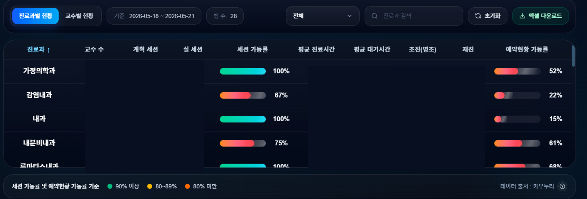

| 컬럼 | 의미 |
|------|------|
| 진료과 | 진료과명 |
| **교수 수** | 해당 과 소속 진료 교수 수 |
| 계획 세션 / 실 세션 | 예약·진행 세션 수 |
| 세션 가동률 | 실 ÷ 계획 (색 막대) |
| 평균 진료시간 / 대기시간 | 분 단위 |
| 초진(병초) / 재진 | 환자 수 |
| 예약현황 가동률 | 예약 충원률 |

### 교수별 현황 표

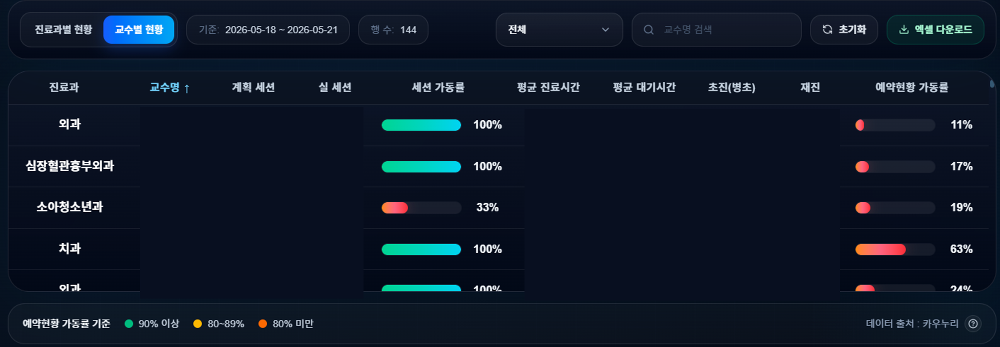

화면 전환 시 검색창 안내 문구도 자동으로 바뀝니다 (`진료과 검색` ↔ `교수명 검색`).

<div style="page-break-before: always"></div>

## 5. 표 정렬·검색·필터링

### 5.1 진료과 드롭다운 필터

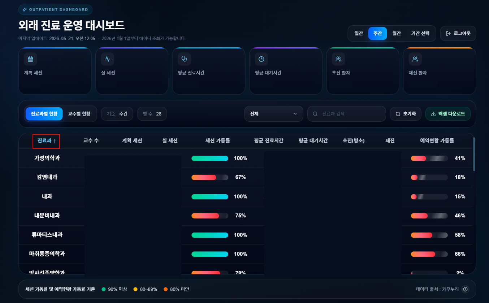

### 5.2 검색

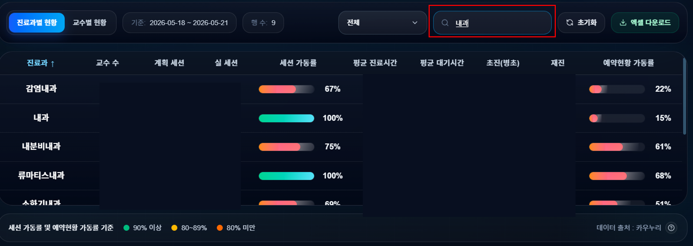

타이핑하면 실시간으로 표가 좁혀집니다 (`진료과 검색` 또는 `교수명 검색`).

### 5.3 컬럼 정렬

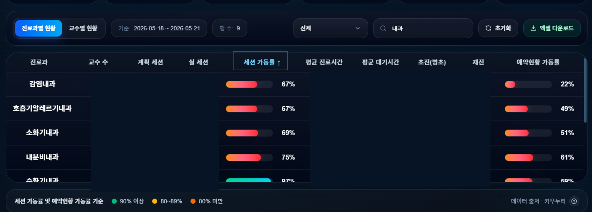

- 헤더 1회 클릭: 오름차순 ↑
- 2회 클릭: 내림차순 ↓
- 다른 컬럼 클릭: 기준 변경

### 5.4 [↻ 초기화] 버튼

검색어·필터·정렬을 한 번에 기본 상태로 되돌립니다.

<div style="page-break-before: always"></div>

## 6. 상세 추세 보기

추세 모달을 여는 **두 가지 진입점**이 있습니다.

| 진입점 | 클릭 위치 | 모달이 보여주는 범위 |
|--------|-----------|----------------------|
| **6.1 개별 행 추세** | 데이터 표의 행 | 선택한 진료과 또는 교수 단일 |
| **6.2 병원 전체 추세** | 좌측 상단 **"외래 진료 운영 대시보드"** 제목 | 병원 전체 합계 |

> ⚠️ 두 진입점 모두 **일간 모드에서는 비활성**됩니다 (추세가 의미 없으므로). 주간·월간·기간 선택 모드에서만 클릭 가능.

---

### 6.1 개별 행 추세 — 표 행 클릭

표의 한 행을 클릭하면 그 **진료과(또는 교수) 단일**의 추세 모달이 열립니다.

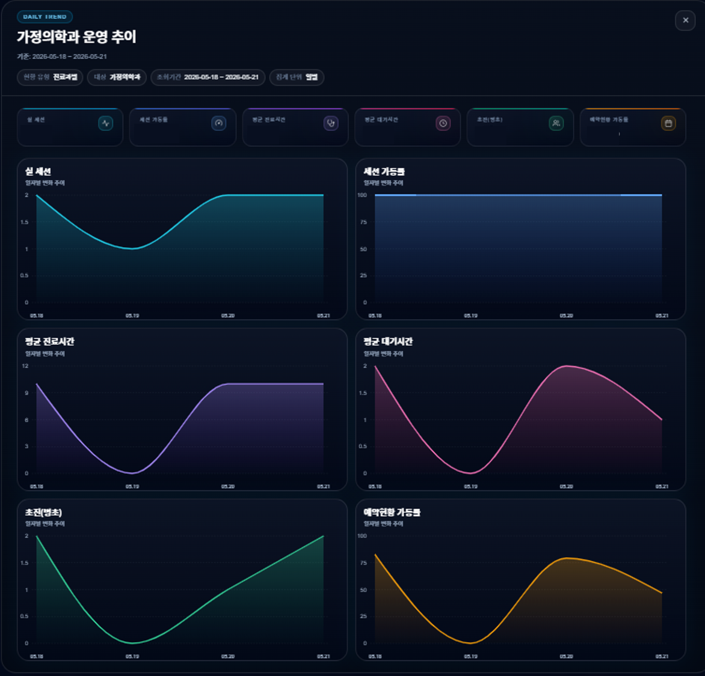

#### 추세 모달 차트 6종

```
 실 세션        │ 세션 가동률
 평균 진료시간  │ 평균 대기시간
 초진(병초)    │ 예약현황 가동률
```

- 마우스 오버 시 툴팁: **날짜 + 요일 + 그날의 수치**
- 닫기: 우상단 **[✕]** 또는 모달 바깥 클릭 또는 키보드 **Esc**

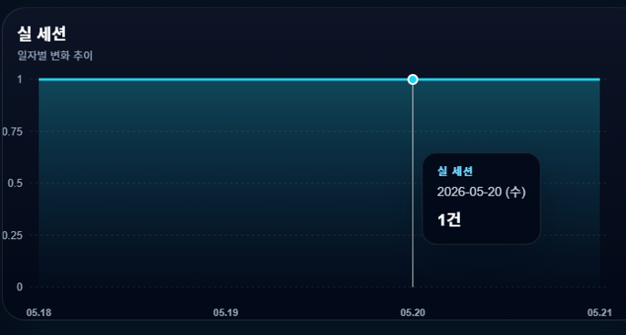

---

### 6.2 병원 전체 추세 — 대시보드 제목 클릭

좌측 상단 **"외래 진료 운영 대시보드"** 제목을 클릭하면 **병원 전체 합계** 기준의 추세 모달이 열립니다. 진료과·교수 구분 없이 모든 데이터를 한 번에 합쳐서 보여줘요.

> 💡 **클릭 가능 여부 힌트**: 주간·월간·기간 선택 모드에서는 제목 위에 마우스를 올리면 **글자색이 하늘색으로 바뀌고 손가락 커서**가 보입니다. 일간 모드에선 이 효과가 없습니다.

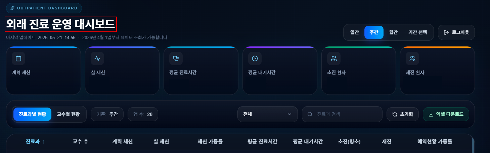

클릭 시 동일한 추세 모달이 열리며, 상단 메타 정보의 **"현황 유형"이 "병원 전체"** 로 표시됩니다.

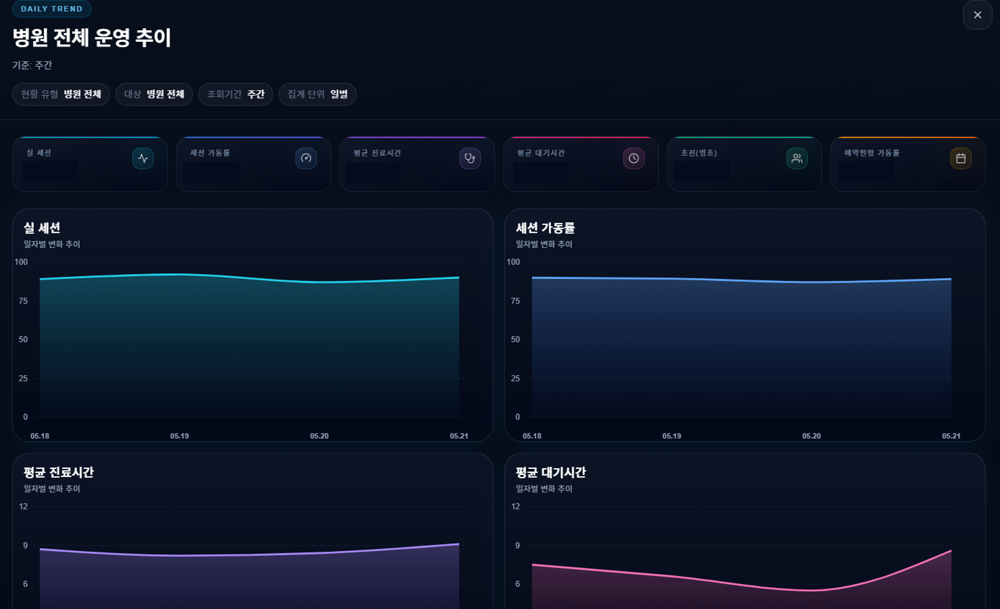

### 두 모달의 차이 정리

| 항목 | 6.1 행 클릭 | 6.2 제목 클릭 |
|------|-------------|---------------|
| 진입 | 표의 한 행 | "외래 진료 운영 대시보드" 제목 |
| 범위 | 선택한 진료과·교수만 | 병원 전체 합계 |
| 메타 배지 "현황 유형" | 진료과별 / 교수별 | **병원 전체** |
| 메타 배지 "대상" | 진료과명·교수명 | 병원 전체 |
| 차트 구성 | 동일 (6종) | 동일 (6종) |
| 닫기 | ✕ / 바깥 클릭 / Esc | 동일 |

<div style="page-break-before: always"></div>

## 7. 엑셀로 내보내기

필터 바 우측의 **[⬇ 엑셀 다운로드]** 버튼을 누르면 현재 화면의 표를 `.xlsx`로 저장합니다.

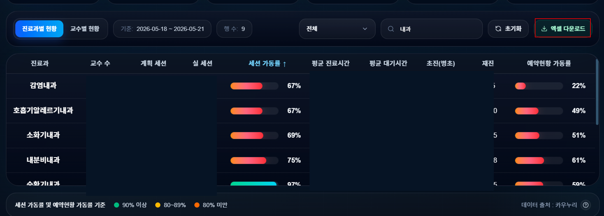

### 다운로드 결과 예시

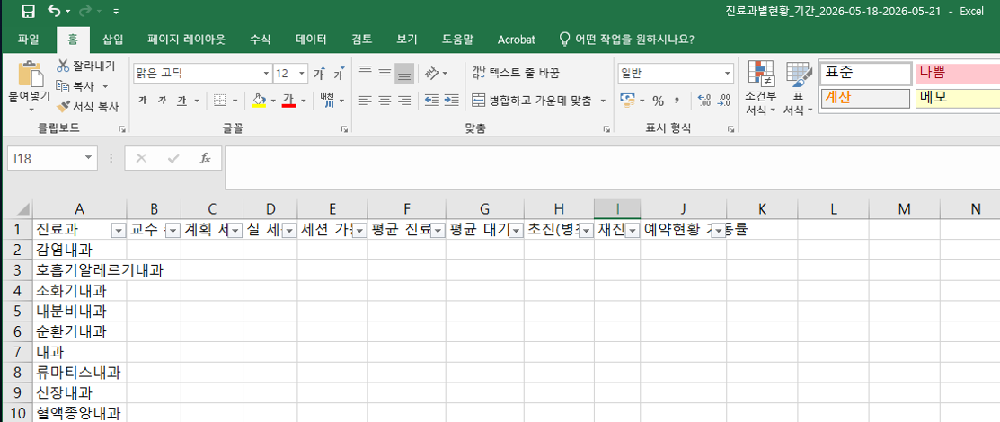

### 동작
- 현재 적용된 **기간·보기 모드·검색·필터·정렬**이 그대로 반영
- 파일명에 자동으로 날짜·기간·보기 유형 포함
- 다운로드 즉시 브라우저 다운로드 폴더에 저장

<div style="page-break-before: always"></div>

## 8. 데이터 출처 확인

표 바로 아래 우측의 **❓ 아이콘**을 누르면 데이터 출처가 팝업으로 표시됩니다.

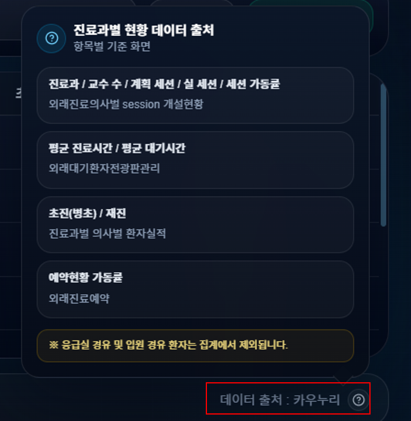

진료과별/교수별 보기에 따라 항목 목록이 달라집니다.

> ※ **응급실 경유 및 입원 경유 환자는 집계에서 제외**됩니다.

<div style="page-break-before: always"></div>

## 문의

- **계정 생성·비밀번호 문제**: 진료운영팀
- **데이터·수치 문의**: 진료운영팀
